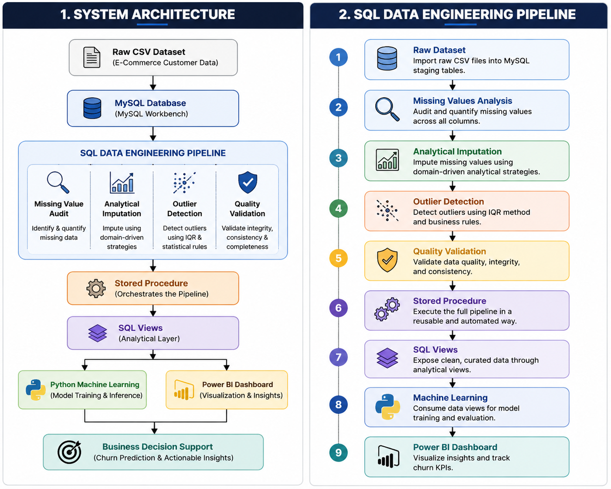

<div align="center">

# 👑 Enterprise-Grade E-Commerce Churn Prediction Pipeline

### End-to-End Data Engineering • Machine Learning • Business Intelligence

A complete production-inspired Data Engineering pipeline designed to predict customer churn before it happens.

Instead of focusing solely on building a Machine Learning model, this project demonstrates how understanding data, engineering robust SQL pipelines, and transforming raw transactional records into reliable analytical assets can significantly improve predictive performance and business value.

---


</div>

---

# 📖 Project Overview

Customer churn is one of the most expensive problems facing subscription-based businesses. Losing an existing customer is often significantly more expensive than retaining one.

The objective of this project is therefore not simply to predict churn, but to identify customers who are likely to leave **before they actually leave**, allowing the business to intervene through targeted retention strategies.

This repository demonstrates a complete engineering workflow that begins with raw transactional data, passes through analytical SQL preprocessing, continues with Machine Learning modeling, and finally delivers executive-level business insights through an interactive Power BI dashboard.

Rather than relying on default preprocessing techniques or simple average imputations, the data cleaning strategy is based on understanding customer behavior and preserving the natural structure of the dataset before any Machine Learning algorithm is trained.

---

# 🏗️ System Architecture & SQL Data Engineering Pipeline

<p align="center">

</p>

<p align="center">
<i>Complete end-to-end architecture of the Data Engineering, Machine Learning and Business Intelligence pipeline.</i>
</p>

---

# 🛠 SQL Data Engineering

Real-world analytical systems rarely consume raw data directly.

Business databases usually contain missing values, inconsistent records, invalid customer information and abnormal financial transactions.

Instead of moving corrupted data directly into Python, the entire preprocessing stage was implemented inside MySQL.

Performing the preprocessing inside SQL provides several important advantages:

- Processing occurs directly on the database server.
- Eliminates unnecessary data transfer.
- Scales significantly better for large datasets.
- Produces reusable analytical tables for future projects.
- Separates Data Engineering from Machine Learning responsibilities.

The SQL project was intentionally divided into multiple independent stages instead of one large script.

Each stage has a dedicated responsibility, making the pipeline easier to maintain, debug and extend in future releases.

---

## Pipeline Stages

### Stage 1 — Data Exploration

- Missing value analysis
- Column auditing
- Initial statistical exploration

### Stage 2 — Analytical Data Cleaning

Instead of replacing missing values using global averages, each missing observation was analyzed according to its surrounding customer behaviour.

This analytical imputation strategy attempts to preserve the original data distribution rather than flattening it.

---

### Stage 3 — Outlier Investigation

Business logic was used to detect unrealistic customer information including impossible ages and abnormal financial values.

Only observations violating logical business constraints were corrected.

---

### Stage 4 — Final Validation

The cleaned dataset was validated to ensure that:

- Missing values were eliminated.
- Invalid records were corrected.
- Machine Learning received consistent input data.

---

### Stage 5 — Automation Layer

The entire pipeline was encapsulated inside a Stored Procedure.

Three SQL Views were then created to expose production-ready datasets directly to Python and Power BI.

This allows future datasets to be processed with a single execution instead of rebuilding the pipeline from scratch.

---

# 🤖 Machine Learning Pipeline

After the SQL pipeline produced a clean analytical dataset, the Machine Learning stage focused on solving the original business problem:

> **Identify customers who are likely to churn before they actually leave.**

Rather than evaluating dozens of algorithms, the objective was to compare fundamentally different learning approaches and understand which type of model best captured customer behavior.

Three models were trained during development:

- Logistic Regression (Linear Baseline)
- LightGBM Classifier
- XGBoost Classifier

The linear model was intentionally included as a baseline to evaluate whether customer churn could be explained using simple linear relationships.

The tree-based models were selected because they are capable of learning complex interactions between customer behaviors that traditional linear models cannot easily capture.

---

## Data Preparation

Before training, the dataset underwent several preprocessing steps.

- Categorical variables were encoded into numerical representations.
- The minority class was balanced through oversampling to reduce class imbalance.
- The dataset was divided into independent Training and Testing subsets.
- Model evaluation was performed exclusively on unseen testing data.

Although oversampling was used during training, the testing dataset always remained untouched to simulate real-world prediction performance.

---

# 🎯 Why Recall?

Many classification projects optimize Accuracy.

This project does not.

The objective is to detect customers who are about to leave before the business loses them.

Missing an actual churned customer is considerably more expensive than contacting one customer who would have stayed anyway.

For this reason, **Recall** became the primary optimization metric throughout the project.

A higher Recall allows marketing teams to identify more at-risk customers and intervene while there is still an opportunity to retain them.

Business objectives should always determine model evaluation—not the other way around.

---

# 📊 Model Evaluation

<p align="center">


</p>

<p align="center">
<i>Confusion Matrix and ROC Curve evaluated on unseen testing data.</i>
</p>

The final evaluation demonstrated a significant performance gap between the linear baseline and the tree-based algorithms.

| Model | Accuracy | Precision | Recall | ROC-AUC |
|-------|---------:|----------:|--------:|---------:|
| Logistic Regression | 72% | 0.51 | 0.73 | 0.785 |
| LightGBM | 98.9% | 0.98 | 0.98 | 0.9995 |
| **XGBoost** | **99.0%** | **0.98** | **0.99** | **0.9994** |

Rather than focusing solely on the final score, this comparison demonstrates an important engineering observation:

Customer churn is driven by complex non-linear behavioral relationships that cannot be captured effectively by simple linear models.

---

# 🔍 Feature Relationship Analysis

Before trusting the model, the dataset itself was investigated.

Pearson Correlation analysis showed that no individual feature exhibited a strong linear relationship with the target variable.

The highest observed correlation remained approximately **0.28**, suggesting that customer churn is not explained by any single feature alone.

Instead, predictive power emerges from combinations of multiple customer behaviors.

This finding is consistent with the superior performance achieved by tree-based learning algorithms.

---

# 🌳 Feature Importance

<p align="center">

</p>

<p align="center">
<i>Feature importance extracted from the final XGBoost model.</i>
</p>

Feature importance analysis provides additional confidence that the model is learning meaningful behavioral patterns rather than relying on isolated variables.

This step also improves interpretability by helping analysts understand which customer characteristics contribute most to churn prediction.

Rather than treating Machine Learning as a black box, the project emphasizes understanding both the predictions and the reasoning behind them.

---

# 📊 Business Intelligence Dashboard

Building a high-performing Machine Learning model is only part of the solution.

Business teams do not make decisions from Python notebooks—they make decisions from dashboards.

For this reason, the final stage of the project focuses on transforming predictive outputs into clear business insights that executives can immediately understand and act upon.

The dashboard was designed to answer one essential question:

> **Which customers require immediate attention before they churn?**

<p align="center">

</p>

<p align="center">
<i>Executive dashboard designed to support customer retention strategies.</i>
</p>

---

## Dashboard Highlights

The dashboard includes several business-oriented visualizations designed for non-technical decision-makers.

### 💰 Revenue at Risk

Estimates the total revenue associated with customers predicted to churn, allowing management to understand the potential financial impact before customers leave.

---

### 📈 Churn Distribution

Provides an overview of the predicted churn population and helps monitor customer retention trends over time.

---

### 🌍 Regional Customer Analysis

Identifies geographical areas where customer churn is concentrated, enabling marketing teams to launch targeted retention campaigns.

---

### 🎛 Interactive Filtering

Users can dynamically filter the dashboard by customer attributes while a custom Reset Filters button restores the original analytical view instantly.

---

# 💼 Business Value

The purpose of this project extends beyond predicting customer churn.

Its objective is to support proactive business decisions.

By identifying customers who are likely to leave before they actually churn, organizations gain valuable time to launch retention campaigns, personalized offers, loyalty programs, or customer engagement initiatives.

Retaining an existing customer is generally less expensive than acquiring a new one.

For this reason, improving early churn detection can directly reduce revenue loss while increasing long-term customer value.

The project therefore demonstrates how Data Engineering, Machine Learning, and Business Intelligence can work together to transform raw customer data into actionable business intelligence.

---

# 🛠 Technology Stack

| Category | Technologies |
|-----------|--------------|
| Database | MySQL Workbench |
| SQL | CTEs, Views, Stored Procedures |
| Programming | Python |
| Data Analysis | Pandas, NumPy |
| Machine Learning | Scikit-learn, LightGBM, XGBoost |
| Visualization | Power BI |
| Version Control | Git & GitHub |

---

# 📂 Repository Structure

```text
ECommerce-Churn-Forensic-Pipeline
│
├── 00_Dataset
├── 01_SQL_Data_Engineering
├── 02_Machine_Learning
├── 03_PowerBI
├── assets
└── README.md
```

---

# 🚀 Version 2 Roadmap

The current version demonstrates a complete end-to-end analytical workflow.

Future releases will focus on expanding scalability, automation, and model interpretability.

Planned improvements include:

- Dynamic SQL validation rules instead of predefined thresholds.
- Advanced text preprocessing for incoming datasets.
- Stratified Cross Validation.
- Hyperparameter optimization using Optuna.
- SHAP Explainability.
- MLflow experiment tracking.
- REST API deployment with FastAPI.
- Docker containerization.
- Real-time prediction service.
- Automated monitoring for data drift.

The long-term objective is to evolve this educational project into a production-oriented analytical platform.

---

# 💡 Lessons Learned

This project reinforced an important engineering principle:

> **Successful Machine Learning begins long before model training.**

Understanding the data, preserving meaningful customer behavior, and designing maintainable engineering workflows often have a greater impact than simply experimenting with additional algorithms.

Another key lesson is that Machine Learning should not be viewed as the final product.

Its real value appears only when predictions are translated into information that business leaders can understand and use to make better decisions.

---

# 👨‍💻 About the Author

## Osama Assar

Biomedical Engineering Graduate with a strong interest in Data Engineering, Machine Learning, and Business Intelligence.

Current areas of focus include:

- SQL Data Engineering
- Predictive Analytics
- Machine Learning
- Business Intelligence
- Healthcare Data Analytics

---

# 📬 Connect With Me

- GitHub
- LinkedIn
- Email

---

# ⭐ Support

If you found this project useful or interesting, consider giving it a ⭐ on GitHub.

Feedback, suggestions, and constructive discussions are always welcome.
